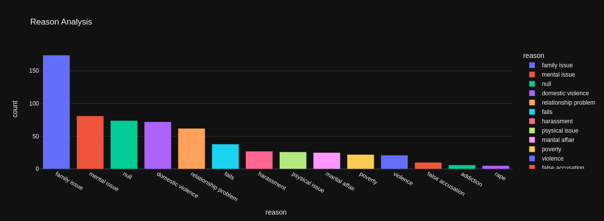
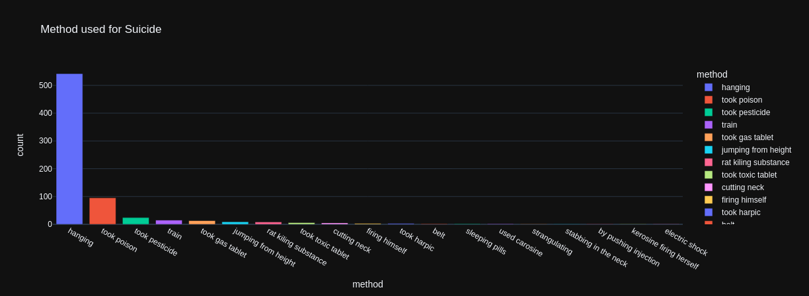
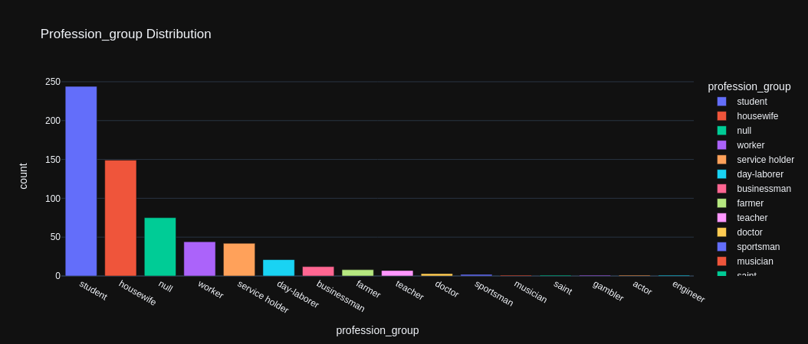
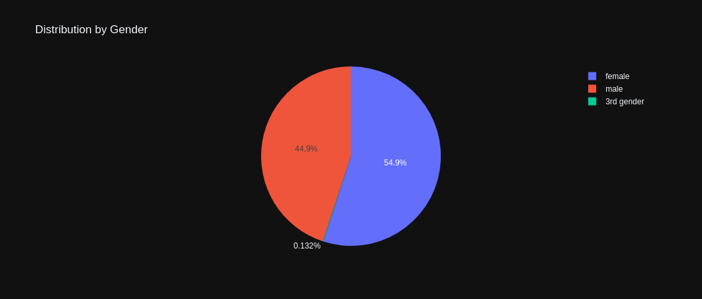
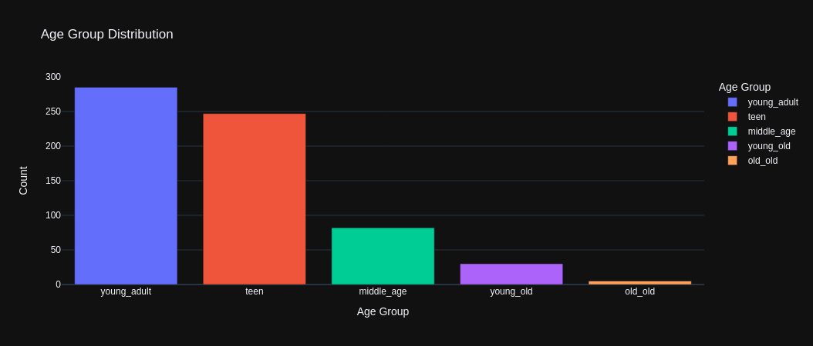
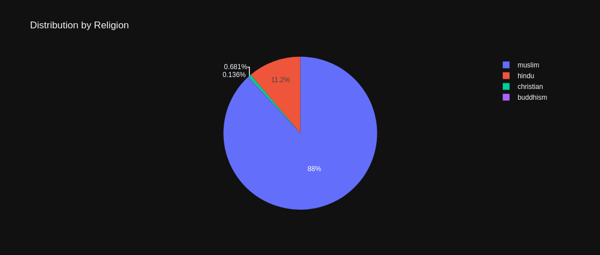
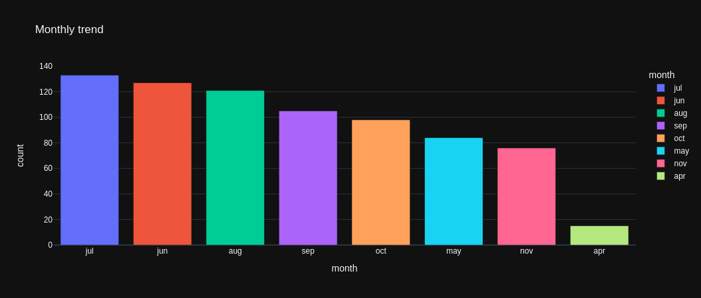
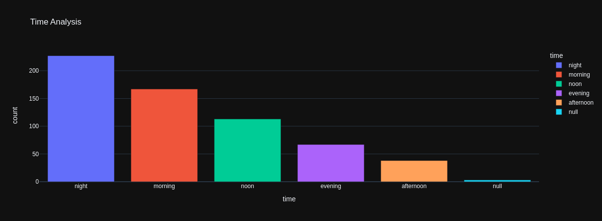
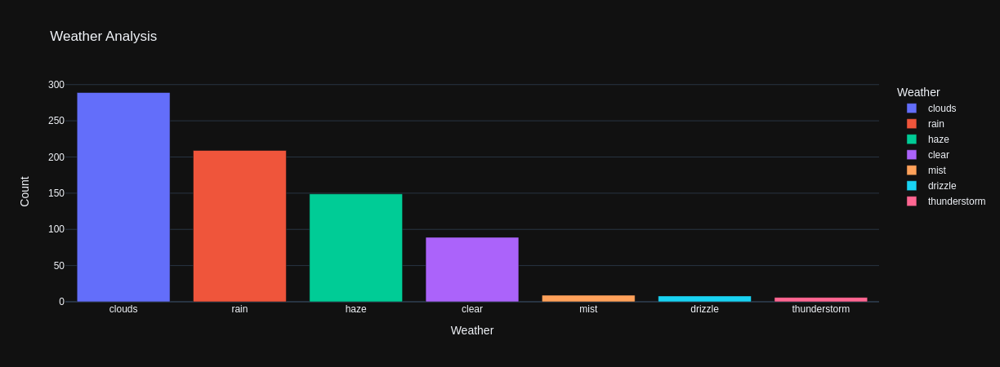
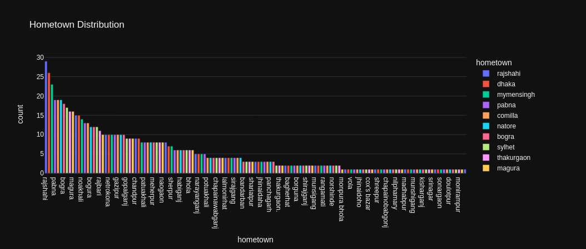

# Suicide Data Analysis in Bangladesh (May 2020 - May 2021)

## Introduction
This project analyzes suicide cases in Bangladesh from May 2020 to May 2021, using a dataset sourced from Kaggle. The analysis aims to uncover key patterns and insights into the causes, methods, demographics, and other factors related to suicide cases. The analysis was conducted using Python, Pandas, Plotly, and Matplotlib.

## Data Cleaning
- **Duplicates Removal**: Removed any duplicate entries.
- **Standardization**: Converted all text values to lowercase.
- **Age Group Creation**: Generated an ‘Age Group’ column.
- **Profession Group Cleanup**: Cleaned the ‘Profession Group’ column.
- **Date Conversion**: Converted Unix timestamps to readable dates.
- **Monthly Trend**: Created a ‘Month’ column.
- **Location Standardization**: Cleaned the ‘Hometown’ column.
- **Method of Suicide**: Consolidated various suicide methods.
- **Reason for Suicide**: Standardized reasons for suicide.
- **Data Frame Management**: Preserved the original dataset and created a new one for analysis.

## Analysis and Insights

### 1. Reason for Suicide
- **Insight**: Family issues were the most common reason, with 174 cases.
- **Visualization**: Bar chart.

### 2. Method of Suicide
- **Insight**: Hanging was the most common method (542 cases).
- **Visualization**: Bar chart.

### 3. Profession Analysis
- **Insight**: Students and housewives had the highest suicide rates.
- **Visualization**: Bar chart.

### 4. Gender Distribution
- **Insight**: Female suicides outnumbered male suicides.
- **Visualization**: Pie chart.

### 5. Age Group Distribution
- **Insight**: Young adults had the highest suicide rate.
- **Visualization**: Bar chart.

### 6. Religious Distribution
- **Insight**: Most suicides were among Muslims.
- **Visualization**: Pie chart.

### 7. Monthly Trend Analysis
- **Insight**: Suicides peaked in July, June, and August.
- **Visualization**: Bar chart.

### 8. Time of Day Analysis
- **Insight**: Most suicides occurred at night.
- **Visualization**: Bar chart.

### 9. Weather Analysis
- **Insight**: Cloudy and rainy weather saw the highest suicide rates.
- **Visualization**: Bar chart.

### 10. Geographical Distribution
- **Insight**: Rajshahi, Dhaka, and Mymensingh had the highest suicide rates.
- **Visualization**: Bar chart.

## Conclusion
This analysis provides valuable insights into the factors contributing to suicides in Bangladesh. The findings can help shape public health interventions to reduce suicide rates.

## References
Data sourced from [Kaggle](https://www.kaggle.com/datasets/shukuralom/bangladesh-suicide).
